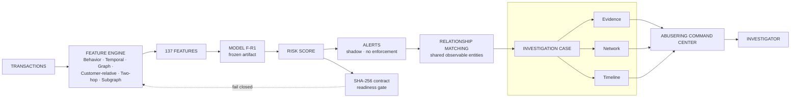
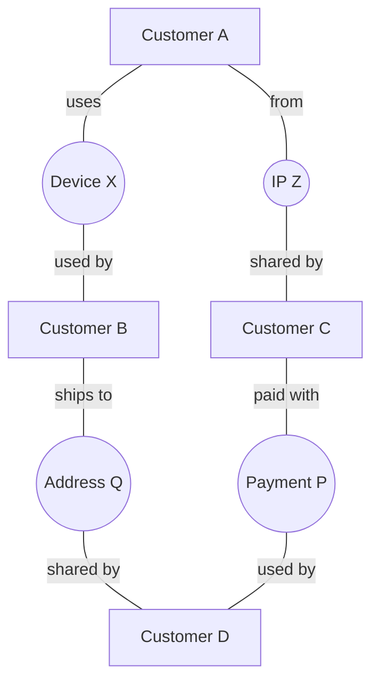

# AbuseRing architecture pitch

## Twenty-second explanation

“Events enter the API and are normalized into a strictly-as-of feature vector.
Redis holds streaming feature state. Frozen Model F-R1 combines temporal,
graph, customer-relative, two-hop, and subgraph evidence, then isotonic
calibration produces a review score. In shadow mode, a non-fallback threshold
crossing creates an alert; observable shared entities may consolidate returned
alerts into a masked case. The Command Center renders returned evidence, graph,
timeline, and analyst workflow.”

## Diagram

## Example relationship diagram

One shared infrastructure node connects supposedly separate customers:

## Design principles

- **Relational signal:** ask what an event is connected to, not only whether the
  event looks suspicious alone.
- **Temporal integrity:** earlier feature state only; future events cannot leak
  into an earlier score.
- **Frozen provenance:** R1 version, ordered 137-feature contract, calibration,
  threshold, and exact artifact checksum are visible and verified.
- **Investigator workflow:** alerts become cases with observed evidence,
  relationship graph, timeline, severity, and analyst history.
- **Safety first:** all current decisions are shadow-only; no customer transaction
  is blocked or modified.

## Current limitations

The inference feature state is Redis-backed, while the current investigator case
repository is process-local in-memory storage. A durable case store and production
identity/RBAC are future work. Synthetic/demo replay is not live production
evidence; seven-day observation remains not started.
